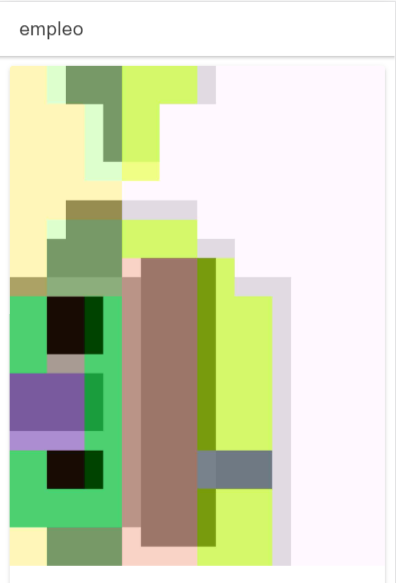
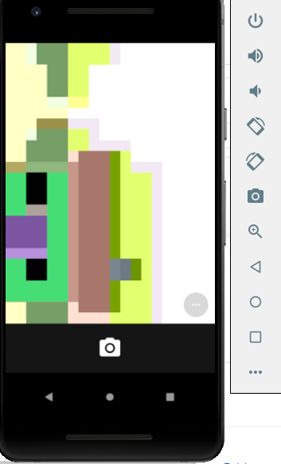

# empleos
Captura de funcionamiento





# Componente geolocal
Muestra la localización actual del usuario por medio de las coordenadas del dispositivo móvil

## Instalación

Dentro de la carpeta del proyecto ingresar los siguientes comandos por el terminal \

$ npm install cordova-plugin-geolocation \
$ npm install @ionic-native/geolocation \
$ ionic cap sync 

## Implementación

Crear el componente mediante el siguiente comando: \
$ ionic generate component components/geolocaL-distance

Importar los plugins en la página app.module.ts

```javascript
import { Geolocation } from '@ionic-native/geolocation/ngx';

providers: [
    ...
    Geolocation,
   ...
  ]...
```

Insertar el siguiente código en el geolocal-distance.component.html

```html
<p>Presionar dos veces para obtener la posición inicial y final</p>
<ion-button (click)="getGeolocation()">Obtener geolocalización</ion-button>
<h3>Latitud inicial:</h3>
<h4>{{lat1}}</h4>
<h3>Longitud inicial:</h3>
<h4>{{lon1}}</h4>
<h3>Latitud final:</h3>
<h4>{{lat2}}</h4>
<h3>Longitud final:</h3>
<h4>{{lon2}}</h4>
```

Y en el geolocal-distance.component.ts

```javascript
import { Component, OnInit, Output, EventEmitter } from '@angular/core';
import { Geolocation, Geoposition } from '@ionic-native/geolocation/ngx';

@Component({
  selector: 'app-geolocal-distance',
  templateUrl: './geolocal-distance.component.html',
  styleUrls: ['./geolocal-distance.component.scss'],
})
export class GeolocalDistanceComponent implements OnInit {

  @Output() obtenerDatos = new EventEmitter<any>();

  lat1:number
  lon1:number
  lat2:number
  lon2:number
  bandera: boolean = true

  constructor(private geolocation: Geolocation) { }

  ngOnInit() {}

  getGeolocation() {
    this.geolocation.getCurrentPosition().then((geoposition: Geoposition) => {
      if (this.bandera) {
        this.bandera = false;
        this.lat1 = geoposition.coords.latitude;
        this.lon1 = geoposition.coords.longitude;
      } else {
        this.bandera = true;
        this.lat2 = geoposition.coords.latitude;
        this.lon2 = geoposition.coords.longitude;
        const datos = {
          lat1: this.lat1,
          lon1: this.lon1,
          lat2: this.lat2,
          lon2: this.lon2
        };
        this.obtenerDatos.emit(datos);
      }
    })
  }

}
```

## Uso

Para agregar este componente a cualquier página html se debe ingresar lo 
siguiente en la <nombre de la página>.module.ts

```javascript
import { GeolocalDistanceComponent } from '../../../components/geolocal-distance/geolocal-distance.component';

@NgModule({
  imports: [
    ...
  ],
  declarations: [..., GeolocalDistanceComponent],
  exports: [..., GeolocalDistanceComponent]
})
```

En <nombre de la página>.page.ts

```javascript
export class <nombre de la página> implements OnInit {

  distance: number;

  constructor() { }

  ngOnInit() {
  }

  calcularDistancia(data) {
    let p = 0.017453292;
    let c = Math.cos;
    let a = 0.5 - c((data.lat1 - data.lat2) * p) / 2 + c(data.lat1 * p) * (1 - c(((data.lon1 - data.lon2) * p))) / 2;
    let dis = (12742 * Math.asin(Math.sqrt(a)));
    this.distance = Math.trunc(dis);
  }

}

```

y en <nombre de la página>.page.html

```html
<app-geolocal-distance (obtenerDatos)="calcularDistancia($event)"></app-geolocal-distance>
<h3>Distancia: {{distance}}</h3>
```


